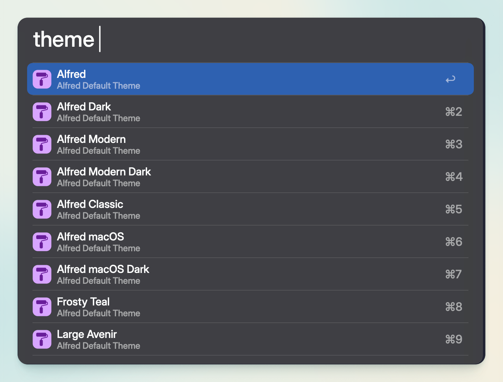

  

<h1 align="center">Alfred Theme Switcher</h1>

A simple Alfred workflow that lets you quickly switch between themes, including both built-in Alfred themes and your custom installed themes.

## Features

- Switch between all Alfred themes from within Alfred

## Usage

`theme` (or your selected keyword) - Show theme list

## Installation

1. Download the latest release
2. Double click the `.alfredworkflow` file
3. Alfred will open and ask you to confirm the workflow installation

## Requirements

- Alfred 5
- Alfred Powerpack (required for themes and workflows)

## License

MIT License

## Credits

- Set theme script inspired by discussion in [Alfred Forum](https://www.alfredforum.com/topic/22047-change-themes-via-shellterminal/)